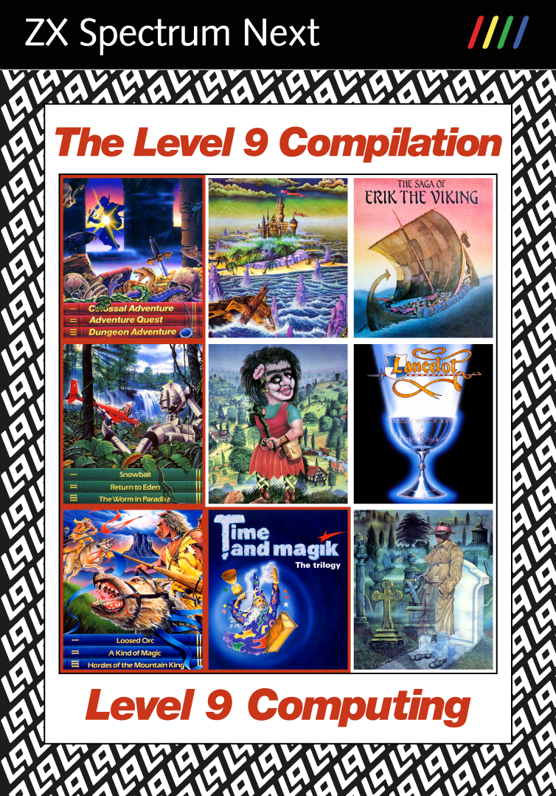

# The Level 9 Compilation

### [DOWNLOAD COMPILATION (auto-bootable overlay)](level9-boot.zip)
### [DOWNLOAD COMPILATION (only the games)](level9.zip)
### [DOWNLOAD CASE COVER AND SD CARD LABEL](resources/case-cover-print.pdf)

The Level 9 Compilation is an unofficial compilation of all of Level 9
Computing's text adventure and multiple choice games for the ZX Spectrum Next.
All in all, there are 19 games: 16 text adventure games and three multiple
choice games.

The compilation includes the latest version of each game (to my knowledge), uses
the [Level 9 interpreter](https://github.com/stefanbylund/zxnext_level9) for
Spectrum Next, has the game files packaged to suit this particular interpreter
and has the graphics converted to Spectrum Next format. It is provided as a
convenience since it can be difficult to find complete versions of some of the
games nowadays. All games in the compilation except the multiple choice games
have been tested with their walkthrough test scripts.

**Note:** The Level 9 games are copyright by Level 9 Computing. This compilation
is not official and its curator is not affiliated with Level 9 Computing. The
compilation is done in loving memory of Level 9 and their classic masterpieces
and without any monetary gain involved. A big thank you to Mike Austin (one of
the Level 9 founders) for his informal approval of this compilation!

**Note:** Some of the games will require the original manual for looking up
words as part of the games' built-in copy protection scheme.

The compilation is provided in two versions: one that auto-boots from an SD card
and another containing just the games.

## Create Your Own Physical Edition

Here are instructions on how to create your own physical edition of The Level 9
Compilation. Note that the PDF to be printed contains three pages: the outer
cover (page 1), the optional inner cover (page 2) and the SD card label (page 3).
If you just want to display the cover without the crop marks for printing, you
can download [case-cover-display.pdf](resources/case-cover-display.pdf) and open
it in [Adobe Acrobat Reader](https://get.adobe.com/reader/).
Thanks to Richard Hallas for creating this beautiful cover!

**Prerequisites:** Case and an empty pre-formatted SD card.

1. Go to [specnext.com](https://www.specnext.com/latestdistro) and download the
lite version of the Spectrum Next system software, e.g.
**System/Next distribution v.1.3.2 LITE VERSION**, and unpack it on an empty
pre-formatted SD card.

2. Download [level9-boot.zip](level9-boot.zip) and unpack it in the root
directory of the same SD card. This is an auto-bootable System/Next overlay that
contains all the games and which will overwrite the default autoexec.bas file to
provide a start menu where you can select which of the games you want to play.

3. Download [case-cover-print.pdf](resources/case-cover-print.pdf) and open it
in [Adobe Acrobat Reader](https://get.adobe.com/reader/). If you can print
double-sided, select pages 1 (outer cover) and 2 (inner cover) and print them
using "short-edge binding" on glossy A4 paper in landscape mode with scaling
set to "actual size". If you can only print single-sided, select page 1 (outer
cover) and print it on glossy A4 paper in landscape mode with scaling set to
"actual size". Cut out the printed cover according to the crop marks.

4. Select page 3 (the SD card label) and print it on glossy self-adhesive paper
with scaling set to "actual size". Cut out the printed label with the help of
the crop marks.

5. Insert the printed cover into the case and stick the label on the SD card.

That's it! Now you have your own physical edition of The Level 9 Compilation!

## How to Run

This compilation is provided in two versions: one version that auto-boots from
an SD card and another containing just the games. The games in the compilations
use the Level 9 interpreter for Spectrum Next which is also available in two
versions: **level9_256.nex**, which uses the standard Spectrum mode (256 x 192)
for displaying the text, and **level9_512.nex**, which uses the Timex hi-res
mode (512 x 192).

**Note:** When updating the compilation to a newer version, if you have save
files that you still want to use, just copy those save files to the new game
folder(s).

### Auto-bootable compilation

Skip steps 1 and 2 if you have already followed the equivalent steps in *Create
Your Own Physical Edition*.

1. Go to [specnext.com](https://www.specnext.com/latestdistro) and download the
lite version of the Spectrum Next system software, e.g.
**System/Next distribution v.1.3.2 LITE VERSION**, and unpack it on an empty
pre-formatted SD card.

2. Download [level9-boot.zip](level9-boot.zip) and unpack it in the root
directory of the same SD card.

3. Insert the SD card into your Spectrum Next computer and start it.

4. This will bring up a start menu where you can select which of the games you
want to play.

**Note:** The first time you boot the SD card, you will see the NextZXOS test
screen and have to select which video mode to use (HDMI/VGA/RGB and 50/60 Hz
refresh rate). Your selection is then stored in the **machines/next/config.ini**
file on the SD card. This is standard procedure for any auto-booting SD card
for the Spectrum Next.

### Games-only compilation

1. Download [level9.zip](level9.zip) and unpack it on an SD card containing the
Spectrum Next system software.

2. Insert the SD card into your Spectrum Next computer and start it.

3. Highlight the **level9.run** runnable directory in the NextZXOS Browser and
press Enter. This will automatically launch its run.bas program, which will
bring up a start menu where you can select which of the games you want to play,
and in what screen resolution.

4. Alternatively, hold Symbol Shift when pressing Enter to manually open the
**level9.run** directory to access its contents. Then go to the desired game
directory and run its **level9_256.nex** or **level9_512.nex** program.

### Emulators

The compilation can also be run in the CSpect and ZEsarUX emulators.

#### CSpect Emulator

1. Install the latest version of the [CSpect](https://dailly.blogspot.se/)
emulator.

2. Make sure CSpect.exe is in your PATH or set the CSPECT_HOME environment
variable to the directory where it is located.

3. Download [level9.zip](level9.zip) and unpack it on your PC.

4. Run the batch file **level9.run/&lt;game&gt;/run_cspect.bat** to start the
selected game.

#### ZEsarUX Emulator

1. Install the latest version of the [ZEsarUX](https://github.com/chernandezba/zesarux)
emulator.

2. Make sure zesarux.exe is in your PATH or set the ZESARUX_HOME environment
variable to the directory where it is located.

3. Download [level9.zip](level9.zip) and unpack it on your PC.

4. Run the batch file **level9.run/&lt;game&gt;/run_zesarux.bat** to start the
selected game.

## Games

Below is a list of the games included in this compilation. Click on a game to
read more about it.

* [Jewels of Darkness trilogy](games.md#jewels-of-darkness-trilogy)
  * [Colossal Adventure](games.md#colossal-adventure)
  * [Adventure Quest](games.md#adventure-quest)
  * [Dungeon Adventure](games.md#dungeon-adventure)
* [Silicon Dreams trilogy](games.md#silicon-dreams-trilogy)
  * [Snowball](games.md#snowball)
  * [Return to Eden](games.md#return-to-eden)
  * [The Worm in Paradise](games.md#the-worm-in-paradise)
* [Time and Magik trilogy](games.md#time-and-magik-trilogy)
  * [Lords of Time](games.md#lords-of-time)
  * [Red Moon](games.md#red-moon)
  * [The Price of Magik](games.md#the-price-of-magik)
* [Emerald Isle](games.md#emerald-isle)
* [The Saga of Erik the Viking](games.md#the-saga-of-erik-the-viking)
* [Knight Orc](games.md#knight-orc)
* [Gnome Ranger](games.md#gnome-ranger)
* [Gnome Ranger II: Ingrid's Back!](games.md#gnome-ranger-ii-ingrids-back)
* [Lancelot](games.md#lancelot)
* [Scapeghost](games.md#scapeghost)
* [Multiple choice games](games.md#multiple-choice-games)
  * [The Archers](games.md#the-archers)
  * [The Secret Diary of Adrian Mole Aged 13 &#190;](games.md#the-secret-diary-of-adrian-mole-aged-13-)
  * [The Growing Pains of Adrian Mole](games.md#the-growing-pains-of-adrian-mole)

## User Interface

The game screen is divided into two sections. The top section shows the graphics
for the current location and the bottom section is the text area which accepts
user input at its prompt. When there are too many lines of text to display on
the screen at once, the message "&lt;MORE&gt;" will appear at the bottom left of
the screen. Pressing any key will continue the scrolling of the text.

The last entered line of input can be edited by pressing the EDIT key.

The graphics can be scrolled up and down using the up and down arrow keys to
make more or less room for the text. If a PS/2 mouse is connected to the
Spectrum Next, it can also be used to scroll the graphics up and down by
dragging it with the mouse or using the mouse wheel.

The text colour can be changed by cycling downwards or upwards through a palette
of 32 colours by pressing TRUE VIDEO and INV VIDEO, respectively. The default
text colour is light grey.

The table below shows the special keys used in the games:

| Spectrum Key |   PS/2 Key    |                               Description                                |
|--------------|---------------|--------------------------------------------------------------------------|
| EDIT         | SHIFT + 1     | Edit last entered line of input.                                         |
| UP           | SHIFT + 7     | Scroll graphics up.                                                      |
| DOWN         | SHIFT + 6     | Scroll graphics down.                                                    |
| TRUE VIDEO   | SHIFT + 3     | Change text colour by cycling downwards through a palette of 32 colours. |
| INV VIDEO    | SHIFT + 4     | Change text colour by cycling upwards through a palette of 32 colours.   |
| Mouse        | Mouse         | Scroll graphics up and down by dragging or by using the mouse wheel.     |

## Commands in text adventure games

The Level 9 interpreter and parser is quite advanced and supports a rich
vocabulary. Below is a list of useful commands if you're new to text adventures,
a list of special commands and a list of commands provided by the interpreter
and not the game itself. Some commands are only supported by certain game
versions, as indicated in parentheses.

Useful commands:

* north (n)
* south (s)
* west (w)
* east (e)
* northwest (nw)
* northeast (ne)
* southwest (sw)
* southeast (se)
* up (u)
* down (d)
* in
* out
* exits (V3/V4)
* go to &lt;previously-visited-location&gt; (V4)
* run to &lt;previously-visited-location&gt; (V4)
* follow &lt;character&gt; (V4)
* look
* wait
* wait for &lt;character&gt; (V4)
* wait for &lt;number-of-turns&gt; (V4)
* wait until &lt;time&gt; (V4)
* inventory (inv)
* take | get &lt;object&gt;
* drop &lt;object&gt;
* examine &lt;object&gt;
* find &lt;previously-found-object&gt; (V4)
* say &lt;something&gt; (V2/V3)
* &lt;character&gt;, &lt;commands-to-character&gt; (V4)

Special commands:

* save - Save the current game position to file.
* restore - Restore a previously saved game position from file.
* ram save - Save the current game position in RAM memory. (V3/V4)
* ram restore - Restore the latest saved game position from RAM memory. (V3/V4)
* undo/oops - Restore the game position as it was before your last command. (V3/V4)
* restart - Restart the game. (V3/V4)
* help - Print help or hints.
* brief/verbose - Select location description mode. (V3/V4)
* exits on/off - Automatically report exits on or off. (V4)
* words/pictures - Turn pictures on or off.
* score - Print the current score.
* again (a) - Repeat the last command.

Interpreter commands:

* #save - Like the save command but bypasses any disk change prompts.
* #restore - Like the restore command but bypasses any copy protection schemes.
* #quit - Quit the game.
* #picture &lt;number&gt; - Test command for showing the picture with the given &lt;number&gt;.
* #seed &lt;number&gt; - Test command for setting the random number seed to the given &lt;number&gt;.
* #play - Test command for playing back a script file as the input to the game.

## Commands in multiple choice games

The multiple choice games are played by repeatedly selecting one of up to three
given choices by pressing key **1**, **2** or **3**. Pressing the **4** key will
open a command mode where you can enter one of the following commands:

* save - Save the current game position to file.
* load - Load a previously saved game position from file.
* restart - Restart the game.
* pictures on/off - Turn pictures on or off.
* help - Print general help or help for the given command.

## Credits

A big thank you to Mike Austin (one of the Level 9 founders) for his informal
approval of bundling this game compilation with the Level 9 interpreter for
Spectrum Next. Thanks Mike for making this possible!

## License & Copyrights

The Level 9 interpreter is licensed under the terms of the GNU General Public
License version 2 and is copyright (C) 1996-2011 by Glen Summers and
contributors. Contributions from David Kinder, Alan Staniforth, Simon Baldwin,
Dieter Baron and Andreas Scherrer.

The Level 9 interpreter porting to ZX Spectrum Next is copyright (C) 2021 by
Stefan Bylund.

The QLStyle font is copyright (C) 2018 by Phoebus Dokos.

The start menu is created with SPUI, copyright (C) 2020 by Stale Pixels.

The case cover and SD card label were designed by Richard Hallas in 2023.

Jewels of Darkness trilogy is copyright (C) 1986 by Level 9 Computing.

Colossal Adventure is copyright (C) 1982, 1986 by Level 9 Computing.

Adventure Quest is copyright (C) 1982, 1986 by Level 9 Computing.

Dungeon Adventure is copyright (C) 1982, 1986 by Level 9 Computing.

Silicon Dreams trilogy is copyright (C) 1986 by Level 9 Computing.

Snowball is copyright (C) 1983, 1986 by Level 9 Computing.

Return to Eden is copyright (C) 1984, 1986 by Level 9 Computing.

The Worm in Paradise is copyright (C) 1985, 1986 by Level 9 Computing.

Time and Magik trilogy is copyright (C) 1988 by Level 9 Computing.

Lords of Time is copyright (C) 1983, 1988 by Level 9 Computing.

Red Moon is copyright (C) 1985, 1988 by Level 9 Computing.

The Price of Magik is copyright (C) 1986, 1988 by Level 9 Computing.

Emerald Isle is copyright (C) 1985 by Level 9 Computing.

The Saga of Erik the Viking is copyright (C) 1985 by Level 9 Computing.

Knight Orc is copyright (C) 1987 by Level 9 Computing.

Gnome Ranger is copyright (C) 1987 by Level 9 Computing.

Gnome Ranger II: Ingrid's Back! is copyright (C) 1988 by Level 9 Computing.

Lancelot is copyright (C) 1988 by Level 9 Computing.

Scapeghost is copyright (C) 1989 by Level 9 Computing.

The Archers is copyright (C) 1985 by Level 9 Computing.

The Secret Diary of Adrian Mole Aged 13 &#190; is copyright (C) 1985 by Level 9 Computing.

The Growing Pains of Adrian Mole is copyright (C) 1987 by Level 9 Computing.
