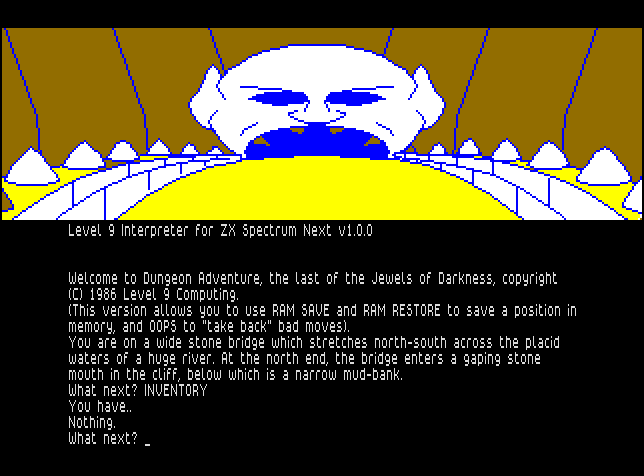
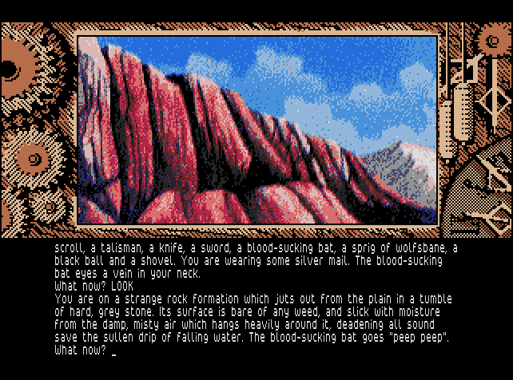

# The Level 9 Compilation

This file contains information about the games included in the [Level 9
Compilation](README.md) for the ZX Spectrum Next. For each game there is a brief
description of the release and information about the year in which it was issued
(original release year in parentheses), the original platform from which the
files are taken, the game version used and the type of graphics in the game.

There are four main versions of the Level 9 game file format: V1 to V4. The
Level 9 interpreter for Spectrum Next only supports V2-V4 games in order to
minimise the interpreter size and since all V1 games were re-released as V2/V3
games anyway.

There are two types of graphics used in the Level 9 games. The earlier releases
used line-drawn graphics that were memory-efficient and portable but very
simple. The later games used platform-specific bitmap graphics; first, digitised
pictures that were an improvement on the previous line-drawn graphics but still
a bit rough, and then later hand-drawn bitmap pictures of top quality.

Note: two of the included games mix game files from IBM PC with bitmap files
from Commodore Amiga. The reason for this is that the game files from the Amiga
version didn't work with the walkthrough test scripts for these games, while the
game files from the PC version worked fine. The graphics are better in the Amiga
version, though, so the bitmap files are taken from there. This works fine since
the bitmap files have the same names in both versions.

## Jewels of Darkness trilogy

The three games comprising the Jewels of Darkness trilogy were Level 9's
earliest releases. Issued as three individual games in 1982 under Level 9's
own brand, they were originally known informally as the Middle Earth Trilogy.
Later, the games were significantly revised and updated and published together
as a formal trilogy in lavish packaging by Rainbird in 1986, under the new
collective title, Jewels of Darkness.

### Colossal Adventure

Colossal Adventure is a complete, full-size version of the classic mainframe
game "Adventure" with all the treasures, creatures, rooms and puzzles of the
original. And we have added 70 bonus locations to the end-game. No one else
gives you this. Visit Colossal Cavern and meet the giant snake, Chinese dragon
and mercenary troll, and watch out for the knives of the evil dwarfs. No true
adventurer should miss this game.

* Year: 1986 (1982)
* Original platform: Atari ST
* Game version: V3
* Graphics type: Line-drawn

### Adventure Quest

Hundreds of years have passed since the time of Colossal Adventure and evil
forces are invading the land. One hope remains: you must discover the old roads
to the Dark Tower, fortress of the Demon Lord. Only there can you defeat him.
The way is long and dangerous, through nine different regions of forest, desert,
mountain, water, fire etc., but with cunning you can make it to the final
confrontation with Agaliarept.

* Year: 1986 (1982)
* Original platform: Atari ST
* Game version: V3
* Graphics type: Line-drawn

### Dungeon Adventure

Dungeon Adventure completes the Jewels of Darkness trilogy. The Demon Lord has
been defeated and his Dark Tower cast down. But its dungeons remain, filled with
hoarded treasure and magic. There are just two snags. Other creatures want the
loot as well, and many guardians remain: skeletons, carnivorous jellies, black
balls etc. Even an orc or two. Success will not come easily!

* Year: 1986 (1982)
* Original platform: Atari ST
* Game version: V3
* Graphics type: Line-drawn

## Silicon Dreams trilogy

In just the same way as with the Jewels of Darkness trilogy, Silicon Dreams took
three formerly individual Level 9 releases, this time with a science fiction
theme, and packaged together enhanced versions in a lavish box from Rainbird
in 1986.

### Snowball

The massive starship, Snowball 9, is carrying two million hibernating colonists
to Eden, fertile planet in the Eridani star system, in this top selling game
with over 7000 locations. The Snowball has been hijacked and is heading into the
sun in this first part of the Silicon Dreams trilogy. You'll meet Waldroids,
Nightingales and other strange robots in this massive science fiction adventure.
But the most baffling puzzle, according to many players, is how to use the
control room computer.

* Year: 1986 (1983)
* Original platform: Atari ST
* Game version: V3
* Graphics type: Line-drawn

### Return to Eden

Return to Eden is the sequel to Snowball. Marooned in the deadly paradise of
Eden's jungles, you must use the weird plant life to survive. Then tackle the
strange robot city to secure the fate of the whole planet. Examine the air bush,
explore the maze and maybe find your roots. Then meet Graunch the golem, Big
Brother and pesky Pepsy Koala, to name just a few of the robots. This is quite
a game!

* Year: 1986 (1984)
* Original platform: Atari ST
* Game version: V3
* Graphics type: Line-drawn

### The Worm in Paradise

The Worm in Paradise concludes the Silicon Dreams trilogy and is set in the far
future. Mankind rules a hundred planets and this empire is expanding throughout
the galaxy. Utopia seems at hand, but one threat remains... Too many nearby
planets can support human life and this cannot be by chance. It probably means
mankind was intended to spread throughout the stars. But then what? Are we
dealing with a benevolent God, or could mankind have been seeded by a cosmic
farmer who will soon return to harvest his crop?

* Year: 1986 (1985)
* Original platform: Atari ST
* Game version: V3
* Graphics type: Line-drawn

## Time and Magik trilogy

Time and Magik was the third collection of individual Level 9 releases to be
updated and repackaged as a formally titled trilogy by a new publisher, though
on this occasion that publisher was Mandarin rather than Rainbird.

### Lords of Time

In Lords of Time, the evil Timelords are fighting to change world history with
the aim of gaining permanent control over Time and warping eternity according
to their wishes. You must travel through the eons inside an amazing grandfather
clock. Visit many different time zones to search out nine essential artefacts,
and combine them to protect Time and Magik and avert the evil planned by the
Timelords.

* Year: 1988 (1983)
* Original platform: Amiga
* Game version: V4
* Graphics type: Digitised bitmap

### Red Moon

Red Moon re-enacts a tale from the time where Magik still worked and when
mythical monsters guarded fabulous treasure. You have the use of many weapons
and a dozen different magical spells to help you rescue the Red Moon Crystal,
the only source of Magik in the land.

* Year: 1988 (1985)
* Original platform: Amiga
* Game version: V4
* Graphics type: Digitised bitmap

### The Price of Magik

The House of the Red Moon is a weird place, haunted by arcane powers from the
mythical past. It is the only place where one might rise from Sorcerer's
Apprentice to powerful Wizard, yet cheat the Price of Magik. The Price of Magik
is the sequel to Red Moon.

* Year: 1988 (1986)
* Original platform: Amiga
* Game version: V4
* Graphics type: Digitised bitmap

## Emerald Isle

Fierce winds seize your aircraft over the Bermuda Triangle and hurl it to
destruction. You escape by parachute, floating downwards to the lonely atoll,
"Emerald Isle", from which few escape. The only way out is to solve its
challenges...

* Year: 1985
* Original platform: Amstrad CPC
* Game version: V2
* Graphics type: Line-drawn

## The Saga of Erik the Viking

A visually dramatic adventure based on the award-winning book by Monty Python
star Terry Jones. Travel as Erik the Viking, in search of the evil Dogfighters
who have kidnapped your family. Explore authentic Viking settlements and seek
help from Wizards, Dragons and Giants in strange lands.

* Year: 1985
* Original platform: Amstrad CPC
* Game version: V2
* Graphics type: Line-drawn

## Knight Orc

Knight Orc is Level 9's most innovative and fun-packed adventure to date. Set in
three parts, it casts you as an oppressed orc in a magical world where all is
not as it first seems. For generations humans have been persecuting orcs, and
now it's time to get your own back. Knight Orc is a challenging game which is
truly interactive. Each character leads its own life in the game, and their
actions can affect you and the outcome of the adventure. Communication with
other characters, learning spells and solving puzzles are all a vital part of
the game if you are to escape the mystical world and take revenge on humankind.

* Year: 1987
* Original platform: PC (game files), Amiga (picture files)
* Game version: V4
* Graphics type: Digitised bitmap

## Gnome Ranger

When Ingrid the Sloane Gnome is banished to the wilderness by her exasperated
family, the monsters don't know what's hit them! Gnome Ranger is a magical
three-part adventure from Level 9.

* Year: 1987
* Original platform: PC (game files), Amiga (picture files)
* Game version: V4
* Graphics type: Digitised bitmap

## Gnome Ranger II: Ingrid's Back!

Jasper Quickbuck, insider-dealing lord of Ridley's Manor, plots to steamroller
the gnome-belt for yuppie housing. To the gnomes' horror, accident-prone Ingrid
Bottomlow, who just escaped from her "holiday" in the wilderness, seems to be
their only hope. When immovable market forces meet the irresistible Ingrid, will
there be a U-turn? Or will humour be the only winner?

* Year: 1988
* Original platform: Atari ST
* Game version: V4
* Graphics type: Hand-drawn bitmap

## Lancelot

Travel back to the Age of Chivalry when knights were bold, galloping across the
countryside and rescuing damsels in distress. Level 9 recreates the time of
wizards and the Knights of the Round Table in their greatest adventure yet.
Lancelot is a three-part adventure, spanning the complete saga from the
foundation of the Order to its finest hour - the quest for the Holy Grail.
Guide Lancelot through his many exploits at Camelot, battle with wayward knights
and win the love of Guinevere and Elaine. The challenge which has fascinated
treasure hunters through the centuries is now yours - and you'll need all your
strength, wits and valour to achieve your goal.

* Year: 1988
* Original platform: Amiga
* Game version: V4
* Graphics type: Hand-drawn bitmap

## Scapeghost

It's not easy being a ghost, betrayed to a criminal gang and falsely blamed for
your own death when they escape with a hostage. Reincarnated in your old haunts,
you have just three nights to clear your name. But with your detective skills
and new psychic powers, a spirited revenge is a dead cert. The gangsters haven't
the ghost of a chance!

* Year: 1989
* Original platform: Amiga
* Game version: V4
* Graphics type: Hand-drawn bitmap

## Multiple choice games

Level 9 published three multiple choice games; they were not so much adventures
as interactive stories in which the player was presented with a series of
choices that could affect the progress of the game to a greater or lesser
extent. The first such game was The Archers for Mosaic Publishing; the second,
also for Mosaic and published in the same year (1985), was an adaptation of
The Secret Diary of Adrian Mole, the first instalment in Sue Townsend's hugely
popular series. The final game of this type was another Adrian Mole book
adaptation, this time based on the similarly popular Growing Pains sequel.
This was not published by Mosaic, however, but rather by Virgin.

### The Archers

If they put you in charge of The Archers, how would you change life in Ambridge?
Here's your chance to find out. In this four-part multiple choice illustrated
text game you are the story editor, taking the plot decisions for Jack Wooley,
Eddie Grundy, Elizabeth Archer and Nelson Gabriel. You're in charge, but you'll
have to face the consequences of your decisions. They may cause a stir in The
Bull - or in Broadcasting House. Watch out for memos from the Controller of
Radio 4 and see how you fare in the charts! Based on the BBC soap opera of the
same name.

* Year: 1985
* Original platform: Amstrad CPC
* Game version: V3
* Graphics type: Line-drawn

### The Secret Diary of Adrian Mole Aged 13 &#190;

I learned today that I am to be the subject of a computer game. The object of
the game is to make me popular with everyone, which sounds dead brilliant.
Apparently they've written an enormous programme containing 200 kilos of text,
which Brainbox Henderson says is a lot. Now everyone else can have a go at
coping with all the problems that beset me over an entire year of my life. This
is a multiple choice illustrated text game for family entertainment and is a
change from Level 9's adventure games. Based on the children's book of the same
title by Sue Townsend.

* Year: 1985
* Original platform: Amstrad CPC
* Game version: V3
* Graphics type: Line-drawn

### The Growing Pains of Adrian Mole

Welcome to the second computer game to feature the contents of my diary - is
there no such thing as privacy? Such is the price of fame, I suppose. The aim of
the game is to make decisions for me through multiple choice questions. Now I
am more mature, life is even more complicated and I have even more decisions to
make, so there is a lot of text in there and some very nice illustrations too.
Some may think it's a game; I prefer to think of it as a sort of quest for the
Meaning of Life - not easy to find in Laurel Close, Leicester! So good luck,
being popular as well as an intellectual is not so easy. I should know, I have
spent all my life trying! Based on the children's book of the same title by Sue
Townsend.

* Year: 1987
* Original platform: Amstrad CPC
* Game version: V3
* Graphics type: Line-drawn

